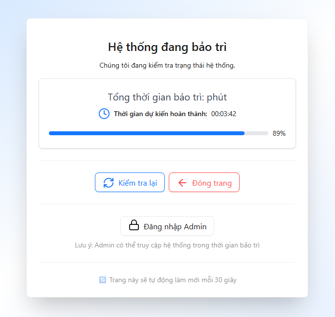

<div align="center">
  <br>
  
  <h2>🛠️ TVT Admin - Maintenance App</h2>
  <p><strong>Ứng dụng hiển thị chế độ bảo trì hệ thống</strong></p>
</div>

<p align="center">
  
  
  
  
</p>

---

## 🧩 Overview

**Maintenance-App** là ứng dụng hiển thị **trạng thái bảo trì hệ thống (Maintenance Mode)** khi ứng dụng chính (**Admin/User App**) đang được nâng cấp hoặc tạm ngừng hoạt động.  
Ứng dụng này có thể kết nối trực tiếp với **API quản lý bảo trì** để điều khiển việc **bắt đầu**, **kết thúc**, hoặc **hủy bảo trì**.

---

## 🚀 Features

- 🕒 Hiển thị thông báo và thời gian dự kiến hoàn tất bảo trì.  
- ⏳ Tự động **đếm ngược thời gian** bảo trì.  
- 🔐 Hỗ trợ chế độ **admin** để bật/tắt bảo trì qua API.  
- 🎨 Giao diện thân thiện, gọn gàng, dễ tùy chỉnh.  
- 🔗 Tích hợp dễ dàng với hệ thống chính (Admin/User).  
- ⚙️ Có thể triển khai **độc lập** trên một port riêng (vd: `3001`).  

---

## 🖼️ Preview

<p align="center">
  
  <br>
  <em>Giao diện trang bảo trì hiển thị đồng hồ đếm ngược và thông báo hệ thống.</em>
</p>

## ⚡ Quick Start

### 🧱 Clone Project

```bash
git clone https://github.com/your-username/maintenance-app.git
cd maintenance-app
pnpm install
```
### 📦 Install Dependencies
```bash
pnpm install
Hoặc dùng npm install / yarn install nếu không dùng PNPM.
```

### 🧑‍💻 Start Development Server
```bash
pnpm dev
Hoặc dùng npm install / yarn install nếu không dùng PNPM.
```
Ứng dụng sẽ chạy tại:
```bash
http://localhost:3001
```

### ⚙️ Environment Variables
Tạo file .env trong thư mục gốc và thêm các cấu hình cần thiết:
```bash
VITE_BACKEND_URL=...
VITE_ADMIN_LOGIN_URL=...
VITE_MAIN_APP_URL=...
```

### 🧭 Folder Structure
```bash
## 🧭 Folder Structure

```bash
maintenance-app/
├── src/
│   ├── components/               # Chứa các component UI chính của ứng dụng
│   │   ├── Countdown/            # Bộ đếm ngược thời gian bảo trì (CountdownTimer)
│   │   ├── Loading/              # Component hiển thị trạng thái đang tải
│   │   └── PageMaintenance/      # Trang chính hiển thị khi hệ thống đang bảo trì
│   │
│   ├── config/                   # Cấu hình hệ thống (ví dụ: maintenance.config.ts)
│   │   └── maintenance.config.ts # Định nghĩa endpoint API, thời gian dự kiến, v.v.
│   │
│   ├── hook/                     # Custom Hooks
│   │   ├── useCountdown.ts       # Hook quản lý bộ đếm thời gian bảo trì
│   │   └── useMaintenanceData.ts # Hook lấy và xử lý dữ liệu bảo trì từ API
│   │
│   ├── types/                    # Định nghĩa kiểu dữ liệu (TypeScript)
│   │   └── maintenance.ts        # Interface, type cho dữ liệu bảo trì
│   │
│   ├── App.tsx                   # Thành phần chính của ứng dụng (trang Maintenance)
│   ├── global.css                # Định nghĩa style toàn cục (TailwindCSS + custom CSS)
│   └── vite-env.d.ts             # Khai báo type cho môi trường Vite
│
├── .gitignore                    # Danh sách file/thư mục bị git bỏ qua
├── index.html                    # Entry HTML file của ứng dụng
├── package.json                  # Danh sách dependencies và script chạy
├── pnpm-lock.yaml                # Khóa phiên bản dependency cho pnpm
├── postcss.config.js             # Cấu hình PostCSS
├── tailwind.config.js            # Cấu hình TailwindCSS
├── tsconfig.json                 # Cấu hình TypeScript compiler
├── tsconfig.config.js            # Cấu hình phụ cho TS (nếu cần trong build hoặc test)
├── vite.config.ts                # Cấu hình Vite (alias, plugin, server, port, v.v.)
└── README.md                     # Tài liệu mô tả dự án (file hiện tại)

```

### 💬 Git Contribution Guideline

#### 🪜 Quy trình đóng góp
1. Tạo branch mới cho mỗi tính năng:
```bash
git checkout -b feature/your-feature-name
```
2. Commit rõ ràng, ngắn gọn:
```bash
feat: add maintenance countdown timer
fix: correct API endpoint for stopMaintenance
```
3. Tạo Pull Request (PR):
- Ghi mô tả chi tiết về tính năng hoặc lỗi đã sửa.
- Đảm bảo dự án chạy được, không lỗi build.
- Kiểm tra format code (pnpm lint nếu có).


#### 🗺️ Roadmap
- 🎨 Thêm Dark Mode.
- 🌐 Hỗ trợ đa ngôn ngữ (i18n).
- ⚡ Thông báo realtime khi admin bật/tắt bảo trì.
- 🧮 Tích hợp Dashboard quản lý bảo trì.

#### 🧑‍💻 Author
Tran Van Thang (TVT)
+ 📧 Email: thangtrandz04@gmail.com
+ 🌐 Website: https://vanthang.io.vn/
